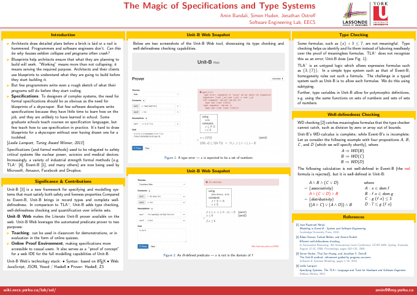
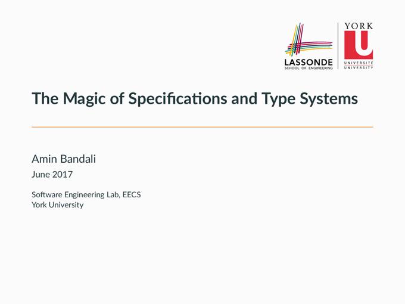

# The Magic of Specifications and Type Systems

This repository contains the source code of the poster and slides of my
presentation for EECS 4080, the Computer Science Project course.

See [Magic of Specifications and Type Systems][mosats] for more information and
for links to rendered versions of the poster and slides. 

## Poster

Use `latexmk -pdf poster.tex` to generate the PDF. Or alternatively,
use `latexmk -pdf -pvc cv.tex` to preview and automatically re-compile when
saving changes.

## Slides

Before compiling the slides follow the instructions to install
the [Metropolis][mtheme] theme. Optionally, you may want to install the Fira
font.

Use `latexmk -xelatex slides.tex` to generate the PDF. Or alternatively,
use `latexmk -xelatex -pvc slides.tex` to preview and automatically re-compile
when saving changes.

## License

The source code for both the poster and slides are licensed under
a [Creative Commons Attribution-ShareAlike 4.0 International License][cc].

[mosats]: https://aminb.org/talks/magic-of-specifications-and-type-systems
[mtheme]: https://github.com/matze/mtheme
[cc]: http://creativecommons.org/licenses/by-sa/4.0/
